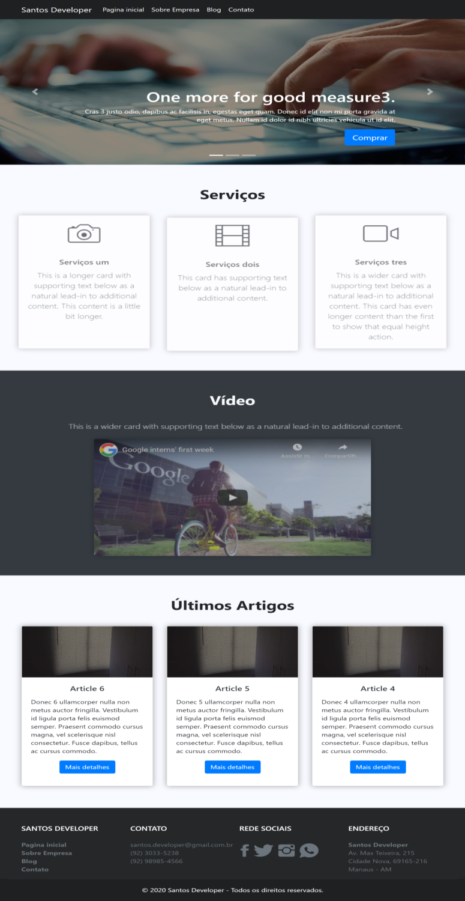
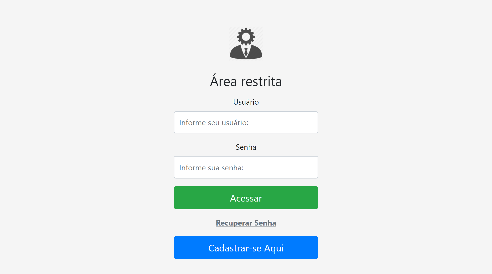
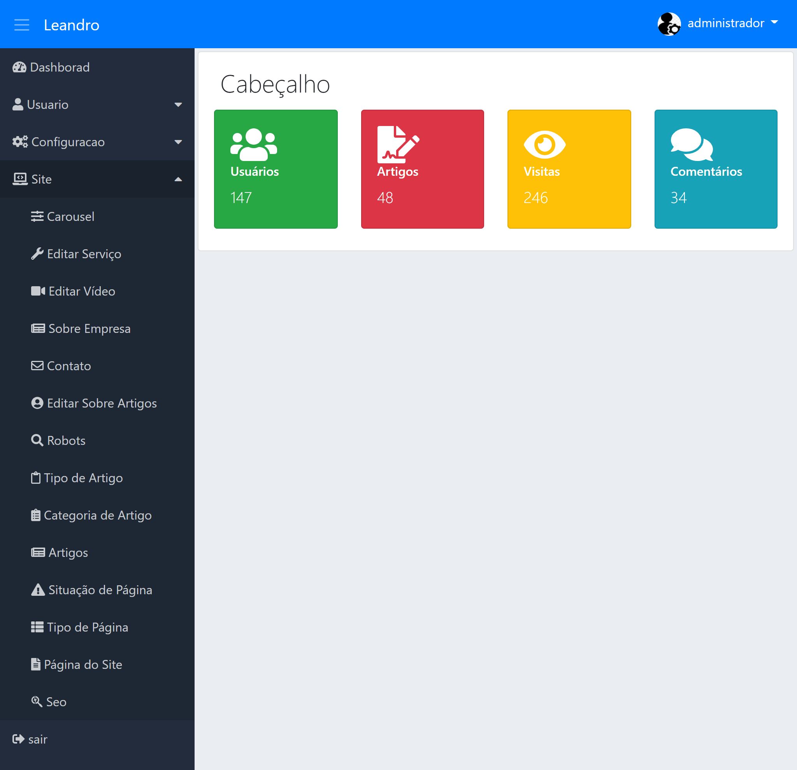

<h1 align="center">
    <p>Site Empresarial e Administrativo</p>
</h1>

<p align="center">
  

  
  
  <a href="https://github.com/LeandroSantosGit/SiteEmpresarialBog-Administrador/commits/master">
    
  </a>

  <a href="https://github.com/LeandroSantosGit/SiteEmpresarialBog-Administrador/issues">
    
  </a>
  
</p>

<p align="center">
  <a href="#computer-projeto"> :computer: Projeto</a>&nbsp;&nbsp;&nbsp;|&nbsp;&nbsp;&nbsp;
  <a href="#rocket-tecnologias"> :rocket: Tecnologias</a>&nbsp;&nbsp;&nbsp;|&nbsp;&nbsp;&nbsp;
  <a href="#gear-instalação"> :gear: Instalação</a>&nbsp;&nbsp;&nbsp;
  <a href="#🤔-como-contribuir">🤔 Como Contribuir</a>&nbsp;&nbsp;&nbsp;|&nbsp;&nbsp;&nbsp;
  <a href="#memo-licença"> :memo: Licença</a>&nbsp;&nbsp;&nbsp;|&nbsp;&nbsp;&nbsp;
  <a href="#mailbox_with_mail-Entrar-em-contato"> :mailbox_with_mail: Entrar em Contato</a>
</p>

## :computer: Projeto

Projeto de desenvolvimento do Site, Blog integrado com comentários, e contato para envio de email ao admnistrador do site. O principal intuito é colocar em prática estudos da lingagem PHP, Bootstrap, HTML, CSS, Composer, Banco de dados e pradrão de projeto MVC.

O site possui Sistema Administrativo de conteúdo, com camadas de usuários, permissões e níveis de acesso as configurações. Configuração como páginas, grupo, tipo, situação e configuração envio de email para contato. 

No site o usuário tem acesso a edição do carousel, serviços, vídeo, sobre empresa, contato. E gerenciar o blog com publicações e edição de artigos, tipo e categoria do artigo, e configuração de SEO.

<h2 style="margin-top: 30px; text-align: center; font-weight: 600;">Site e Blog</h2>
<p align="center">
  
</p>


<h2 align="center">Administrativo do Site</h2>
<p align="center">
  

</p>

## :rocket: Tecnologias

Esse projeto foi desenvolvido com as seguintes tecnologias:

- [PHP 7.4](https://www.php.net/)
- [MySQL](https://www.mysql.com/)
- [phpmailer 6.1](https://github.com/PHPMailer/PHPMailer)
- [Composer 1.8](https://getcomposer.org/)
- [Bootstrap 4.0](https://getbootstrap.com/)
- [Font Awesome 5.9](https://fontawesome.com/)

## :gear: Instalação


* Clone o repo: ```git clone https://github.com/LeandroSantosGit/SiteEmpresarialBog-Administrador.git```

* Vá para o diretório adm: ```cd adm```

* Instale as dependências com o [composer](https://getcomposer.org/): ```php composer install```

* Crie uma base de dados chamada `php_site_gerenciador` no MySQL: ```CREATE DATABASE php_site_gerenciador```
* Em seguida importe o banco de dados que está no diretório: ```cd database```

* Agora configure a URL e credênciais de acesso ao banco de dados:
    * No diretório adm/config: ```cd adm/config``` e configure o arquivo ```Config.php```
    * Vá para o diretório site/core: ```cd site/core```  e configure o arquivo ```Config.php```

* Agora você pode acessar o site e o sistema administrativo nas URLs configuradas para visualizar o projeto.

* **Aceso ao Sistema ->** Login: ```administrador``` Senha: ```123456789```

* **Observação:** para enviar email é necessario configurar as credências como `email`, `host`, `username`, `password`, `smtp`, `port`.

## :memo: Licença

Esse projeto está sob a licença MIT. Veja o arquivo [LICENSE](LICENSE.md) para mais detalhes.

## :mailbox_with_mail: Entrar em contato

<a href="https://twitter.com/rockgolmetal" target="_blank" >
  </a>&nbsp;&nbsp;&nbsp;
<a href="https://www.linkedin.com/in/leandro-s-7811b1151/" target="_blank" >
  </a>&nbsp;&nbsp;&nbsp;
<a href="mailto:santosdeveloper19@gmail.com" target="_blank" >
  
</a> 